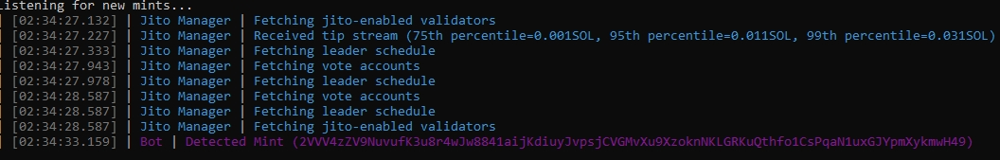

# Pump-Fun Sniper Bot

This repository contains the codebase for the Pump-Fun Sniper Bot developed by [@licketyspliket](https://www.twitter.com/licketyspliket) and me. Although this project is archived and not intended for further iteration, this README provides a comprehensive overview to help anyone who may want to understand or run the bot.

## Overview

The Pump-Fun Sniper Bot is designed to interact with the Solana blockchain, purchasing newly minted coins and managing them, based on our replication of orcACR...'s strategy. I detail the strategy more in my first blog post on this project, which can be found [here](https://www.mikem.codes/if-you-aint-first-youre-last-2/).


## Configuration

### Environment Variables

- `PRIVATE_KEY`: The bot pulls the bot wallet's private key from this environment variable.
- `PROXY_URL`: Set this to an https proxy if you want to proxy the main RPC client

### Main Configuration

The main configuration values for the bot are located in `main.go` and can be edited as needed.

- **Public RPCs**: A slice of public RPC URLs that can be used to help transmit transactions can be modified in the `sendTxRPCs` string slice variable.
- **RPC and WebSocket URLs**: Set `rpcURL` and `wsURL` to their proper values for a high-performance Solana RPC (Note: free/cheap RPC services will likely be ratelimited immediately due to the number of requests needed to vet coins and their creators).
- **MySQL Database**: Ensure you have an instantiated MySQL database with information on coins created. Modify the credentials below as needed:
  ```go
  sql.Open("mysql", "root:XXXXXX!@/CoinTrades")
  ```

### Bot Instantiation

The bot is instantiated with the following parameters:

```go
// Purchase coins with 0.05 Solana, priority fee of 200000 microlamports
bot, err := NewBot(rpcURL, wsURL, privateKey, db, 0.05, 200000)
if err != nil {
    log.Fatal(err)
}
```
### Jito Integration

To remove Jito integration, comment out the following block:

```go
if err := bot.beginJito(); err != nil {
    log.Fatal("Error Starting Jito", err)
}
```

## Installation and Running the Bot

1. **Clone the Repository**:
    ```sh
    git clone https://github.com/1fge/pump-fun-sniper-bot.git
    cd pump-fun-sniper-bot
    ```

2. **Install Dependencies**:
    Ensure you have [Go](https://go.dev/doc/install) installed. Then, run:
    ```sh
    go mod tidy
    ```

3. **Set Environment Variables**:
    Ensure `PRIVATE_KEY` is set in your environment.

4. **Edit Configuration**:
    Modify the RPC URLs, WebSocket URLs, and MySQL database credentials in `main.go` as needed.

5. **Run the Bot**:
    ```sh
    go run .
    ```

## Additional Information

- **Solana RPC and WebSocket**: Ensure you are using high-performance RPC and WebSocket URLs for optimal performance.
- **MySQL Database**: Make sure your MySQL database is properly set up and accessible with the provided credentials.
- **Jito Integration**: Optional integration for improved transaction handling.

## Acknowledgements

A special thank you to [Gagliardetto](https://www.github.com/Gagliardetto) for creating the open-source Solana Go packages that were instrumental in developing this bot. The code we used and built on from him can be found in the `pkg/jito-go` directory, as well as the output from his `anchor-go` package based on the Pump.fun IDL, which is found in the `pump` directory.

Also, a huge thank you to [weeaa](https://www.github.com/weeaa) for their work on [Jito Go SDK](https://www.github.com/weeaa/jito-go), which we used to handle all interactions with Jito.

## Learn More

Read more about the development of this project on my [blog](https://www.mikem.codes/if-you-aint-first-youre-last-reverse-engineering-a-leading-pump-fun-sniper-bot-part-2/).


## What's 0slot? [0slot.trade](https://0slot.trade).

The Premium Solana Transaction Acceleration Service. Built by traders, for traders. As active Solana traders ourselves, we've personally felt the frustration of transaction delays and execution failures. Our team doesn't just understand Solana transactions - we operate several of the top-performing arbitrage bots on the network. This hands-on expertise means we've mastered the art and science of transaction execution, optimization, and timing. We built 0slot after experiencing these pain points firsthand – not just to solve our own challenges, but to empower the entire trading community with the same advantages we developed for our own operations. We leverage this specialized knowledge to ensure your trades land with exceptional speed and reliability. Let us handle the technical complexities of transaction delivery so you can focus on what matters most - making better trading decisions. From traders, for traders (从交易者，为交易者) - that's the 0slot promise.

### staked_conn ###
The usage of the staked_conn interface is similar to the RPC interface, primarily providing the sendTransaction method, which directly connects to our validator node.

When calling the sendTransaction method of staked_conn, please note the following:

- A maximum of 5 calls per second is allowed.
- You need to transfer an amount greater than or equal to 0.0001 SOL to any of the following accounts:
  - 6fQaVhYZA4w3MBSXjJ81Vf6W1EDYeUPXpgVQ6UQyU1Av
  - 4HiwLEP2Bzqj3hM2ENxJuzhcPCdsafwiet3oGkMkuQY4
  - 7toBU3inhmrARGngC7z6SjyP85HgGMmCTEwGNRAcYnEK
  - 8mR3wB1nh4D6J9RUCugxUpc6ya8w38LPxZ3ZjcBhgzws
  - 6SiVU5WEwqfFapRuYCndomztEwDjvS5xgtEof3PLEGm9
  - TpdxgNJBWZRL8UXF5mrEsyWxDWx9HQexA9P1eTWQ42p
  - D8f3WkQu6dCF33cZxuAsrKHrGsqGP2yvAHf8mX6RXnwf
  - GQPFicsy3P3NXxB5piJohoxACqTvWE9fKpLgdsMduoHE
  - Ey2JEr8hDkgN8qKJGrLf2yFjRhW7rab99HVxwi5rcvJE
  - 4iUgjMT8q2hNZnLuhpqZ1QtiV8deFPy2ajvvjEpKKgsS
  - 3Rz8uD83QsU8wKvZbgWAPvCNDU6Fy8TSZTMcPm3RB6zt

### Special Error Codes ###

- **API Key Expired**
```json
{"id":"1","jsonrpc":"2.0","error":{"code":403,"message":"API key has expired"}}
  ```

- **Non-sendTransaction Method**
```json
{"id":"1","jsonrpc":"2.0","error":{"code":403,"message":"Invalid method"}}
  ```

- **Rate Limit Exceeded**
```json
{"id":"1","jsonrpc":"2.0","error":{"code":419,"message":"Rate limit exceeded"}}
```

### Example ###

Add an instruction to the Transaction (preferably inserted at the beginning):
```javascript
transaction.addInstruction(fromPublicKey, '6fQaVhYZA4w3MBSXjJ81Vf6W1EDYeUPXpgVQ6UQyU1Av', 100000);
```

We hope the above information helps you better understand and use the staked_conn interface. If you have any questions, please feel free to contact our support team.
